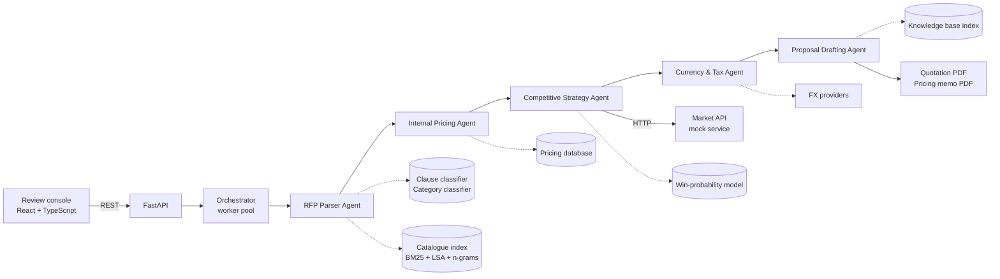

# Tenderdesk — Autonomous RFP Response & Competitive Quotation

Tenderdesk turns a client's request for proposal into a priced, tax-correct,
branded quotation in seconds. A reviewer then approves it. The system reads the
request, checks internal cost and stock, looks up competitor prices, and
chooses a price for every line. When a competitor is priced **below our own
landed cost**, it does not follow them down. It holds a compliant price and
competes on value instead, by bundling warranty or services. Every decision
comes with a plain-language rationale.

**No large language model is used anywhere.** Parsing, matching, pricing and
writing all use explicit rules, classical information retrieval, and models
trained in this repository with scikit-learn.


---

## Contents

1. [What it does](#what-it-does)
2. [Deliverables mapped to features](#deliverables-mapped-to-features)
3. [Architecture](#architecture)
4. [Quick start](#quick-start)
5. [Using the application](#using-the-application)
6. [How the intelligence works](#how-the-intelligence-works)
7. [Project structure](#project-structure)
8. [API](#api)
9. [Testing](#testing)
10. [Build phases](#build-phases)

---

## What it does

| Step | Stage (agent) | Result |
|------|---------------|--------|
| 1 | **RFP Parser Agent** | Extracts the client, contact, delivery location, currency, deadlines, commercial terms, every requested item with its specification, and every requirement clause. Matches each item to a catalogue SKU. |
| 2 | **Internal Pricing Agent** | Reads landed cost, list price, margin floor, volume tier, stock, lead time and eligible bundle services from the internal pricing database. |
| 3 | **Competitive Strategy Agent** | Queries the competitor market API and normalises offers to rupees. Picks the price and bundle that maximise expected profit within policy, and applies the value-differentiation pivot when a competitor is below cost. |
| 4 | **Currency & Tax Agent** | Converts to the client's currency (live FX with fallbacks and a hedging buffer) and applies jurisdiction tax: GST/IGST, destination VAT/GST/sales tax, export zero-rating and reverse charge. |
| 5 | **Proposal Drafting Agent** | Writes the proposal from retrieved knowledge-base evidence: cover letter, executive summary, compliance matrix, delivery plan and terms. Renders a **client quotation PDF** and a **confidential pricing memo PDF**. |

The reviewer works in the web console. They inspect each line's rationale,
adjust price, bundle, product match or currency, re-price, and approve. Approval
issues the final PDF without the draft watermark.

## Deliverables mapped to features

| Required deliverable | Where it lives |
|----------------------|----------------|
| Multi-agent framework with separated roles | `backend/app/agents/` — five agents behind one `Agent` contract, communicating only through typed messages (`messages.py`), coordinated by `orchestrator.py` |
| Mocked competitor database/API queried dynamically | `backend/app/market/service.py` — a separate FastAPI service (API-key auth, own data) queried over HTTP by `services/market_client.py`. Prices drift daily and include below-cost promotions |
| Professional PDF quotation with line items and margins | `backend/app/services/pdf_renderer.py` — client quotation (schedule, taxes, totals, inclusions, compliance, delivery plan, terms, acceptance) and internal memo (cost, floor, margin, win probability, scenarios, rationale) |
| Approval UI showing pricing logic and strategy reasoning | `frontend/src/pages/request/` — pricing table, line sheet with numbered rationale, price-position scale, win/profit curve, alternatives, competitor offers, overrides, approve/decline |
| Multi-currency and regional tax | `backend/app/finance/` — FX provider chain and tax engine (Indian GST split, US state sales tax with category brackets, Canadian GST/HST/PST/QST, EU/UK/Gulf/APAC VAT/GST, export zero-rating, reverse charge) |
| Relational database for pricing data | SQLAlchemy models in `backend/app/db/models.py` (SQLite by default; any SQLAlchemy URL works) |
| Currency conversion API | ECB rates via Frankfurter, then open.er-api.com, then a cached copy in the database, then a reference table |

## Architecture



Each agent reads the messages it depends on from the pipeline context and
writes exactly one message of its own. Every execution is stored as a stage
run: status, timing, summary and an ordered decision log. When a reviewer
changes a line, only the downstream stages re-run, and the proposal version
increments. Several requests are processed in parallel on a worker pool.

## Quick start

Requirements: **Python 3.10+** and **Node.js 18+**.

**macOS / Linux**

```bash
./run.sh
```

**Windows (PowerShell)**

```powershell
.\run.ps1
```

Then open **http://127.0.0.1:8000**. On first start the database is seeded and
the models are trained. This takes about ten seconds and happens once.

### Development mode

```bash
# terminal 1 — API with auto-reload
cd backend
pip install -r requirements.txt
python -m uvicorn app.main:app --reload --port 8000

# terminal 2 — web app with hot reload (proxies /api to :8000)
cd frontend
npm install
npm run dev          # http://localhost:5173
```

To run the competitor market as a genuinely separate service:

```bash
cd backend
python -m uvicorn app.market.service:market_app --port 8100
export TD_MARKET_API_URL=http://127.0.0.1:8100   # then start the main API
```

Configuration options are listed in [`.env.example`](.env.example).

## Using the application

1. **New request** — drag in PDF, DOCX or TXT files (several at once are
   processed in parallel), or paste text. Seven sample requests are included in
   [`samples/`](samples/), covering domestic India (intra- and inter-state), UAE,
   United States, Germany, United Kingdom (PDF) and Singapore (DOCX). The text
   samples can also be loaded from the New request page.
2. **Request → Pricing** — every line shows cost, best competitor, our price,
   margin, win probability and strategy. Open a line to see the full rationale,
   the price-position scale, the win/profit curve, alternatives considered and
   competitor offers. You can override price, bundle, product or quantity, or
   exclude the line.
3. **Requirements** — extracted terms, item-to-product matching with confidence,
   and each clause with the compliance response and cited evidence.
4. **Quotation** — commercial schedule in the client's currency with taxes, cover
   letter, delivery plan, inclusions and an embedded PDF preview. You can change
   the quote currency or FX buffer here.
5. **Approve** — issues the final quotation and records the approval in the memo.

| | |
|---|---|
|  |  |
|  |  |
|  |  |
|  |  |

## How the intelligence works

A condensed version follows. [`docs/ARCHITECTURE.md`](docs/ARCHITECTURE.md) has
the full detail and formulas.

**Language processing (no LLM).** A deterministic analyser handles accent
folding, unit-aware tokenisation (`16GB` → `16 gb`), compound splitting
(`ISO/IEC` → `iso`, `iec`), light stemming and English number words
("twenty-five", "a dozen", "2 lakh"). Header fields, addresses and headings are
recognised by rules. Locations are resolved with a gazetteer of 30 countries and
their states and cities.

**Trained models (scikit-learn), trained in this repository.**

* *Clause classifier* — TF-IDF word/bigram + character n-grams → logistic
  regression. Assigns eight clause types. Trained on a template-grammar corpus
  and evaluated on **template families never seen in training** (~85% accuracy).
* *Category classifier* — predicts the product category of a requested item
  (~98% held-out accuracy). Its probabilities act as a prior during catalogue
  retrieval and penalise implausible matches.
* *Win-probability model* — logistic regression on 2,400 historical bids, with
  segment-specific price elasticity, warranty and lead-time differences,
  bundled value-add and repeat-customer effects (AUC ≈ 0.75). The learned
  coefficients recover the market's true behaviour. For example, bundling
  multiplies the odds of winning by ≈1.75.

**Retrieval-augmented generation without an LLM.** A hybrid index fuses Okapi
BM25, latent semantic vectors (TF-IDF + truncated SVD) and character n-grams
into an absolute relevance score, with MMR for diversity. It is used twice:

* resolving free-text line items to SKUs, re-ranked by specification fit (RAM,
  storage, screen size, ports, PoE, VA rating, CPU tier and more), brand and
  category coherence;
* grounding the proposal. A two-stage search (sections, then sentences) pulls
  evidence from the company knowledge base into the cover letter, compliance
  matrix and delivery plan, with every source logged. Text is composed by
  sentence planning and templates, never free generation.

**Pricing strategy.** For each line the engine searches price × bundle to
maximise

```
E[profit] = (price − landed cost − bundle cost) × quantity × P(win | offer)
```

subject to hard guard-rails: price ≥ margin floor, bundle funded from margin
above the floor, and bundle cost ≤ 6% of price. P(win) is adjusted for the
buyer's award rule (L1 tenders double price sensitivity). Offers below a 20%
target win probability are dropped in favour of the most competitive compliant
offer.

When the best competitor is **below our landed cost**, price-matching is
rejected outright. The engine restricts itself to bundled configurations and
picks the value-add that buys the most win probability. The rationale states the
loss that matching would have caused. The strategy labels are *Value
differentiation, Floor defence, Competitive undercut, Competitive match, Margin
capture, Value premium, Standard pricing* and *Reviewer override*.

## Project structure

```
backend/
  app/
    agents/        base contract, typed messages, five agents, orchestrator
    api/           REST endpoints (requests, reference data)
    db/            SQLAlchemy models, session, seeder
    data/          catalogue, tax rules, FX reference, gazetteer, market data,
                   pricing policy, knowledge base (markdown)
    finance/       currency provider chain, tax engine, money formatting
    market/        mock competitor market API (separate FastAPI app)
    ml/            corpora, models, registry
    nlp/           analyser, gazetteer, extractors, line-item extraction
    pricing/       strategy engine
    rag/           hybrid index, knowledge and catalogue stores
    services/      document ingestion, market client, PDF renderer
    assets/fonts/  Inter (OFL) for PDFs
  tests/           unit, agent, API and end-to-end tests
frontend/          React + TypeScript + Tailwind review console
samples/           seven sample requests (TXT, PDF, DOCX)
scripts/           sample document generator
docs/              roadmap, architecture notes, screenshots
```

## API

Interactive documentation is served at **/docs** (Swagger UI) while the server
is running. The main endpoints:

| Method | Path | Purpose |
|--------|------|---------|
| `POST` | `/api/rfps` | Submit pasted text |
| `POST` | `/api/rfps/upload` | Submit one or more PDF/DOCX/TXT files |
| `GET` | `/api/rfps`, `/api/rfps/{id}` | List, and full detail (parsed data, pricing, proposal, stage logs, events) |
| `POST` | `/api/rfps/{id}/reprice` | Apply reviewer overrides and re-run from costing |
| `POST` | `/api/rfps/{id}/approve` · `reject` · `reopen` · `retry` | Workflow actions |
| `GET` | `/api/rfps/{id}/documents/{quotation\|memo}` | PDFs |
| `GET` | `/api/dashboard` | KPIs |
| `GET` | `/api/catalog/products` · `PATCH /api/catalog/products/{sku}` | Pricing database |
| `GET` | `/api/market/offers` · `/api/market/competitors` | Market intelligence |
| `GET` | `/api/finance/fx` · `POST /api/finance/tax-preview` | Currency and tax |
| `GET` | `/api/models` · `POST /api/models/retrain` · `GET /api/knowledge/search` | Models and retrieval |
| `GET` | `/market-api/v1/...` | The mock market service (requires `X-Api-Key`) |

## Testing

```bash
cd backend
python -m pytest            # 44 tests: language core, parser, finance, pricing, drafting, API workflow
cd ../frontend
npm run typecheck
```

## Build phases

The project was built in ten phases, each committed separately. See
[`docs/ROADMAP.md`](docs/ROADMAP.md).

---

*Academic project. Company names, customers, competitors and prices are
fictitious; product names are used descriptively. Inter font © The Inter
Project Authors, SIL Open Font License 1.1.*
